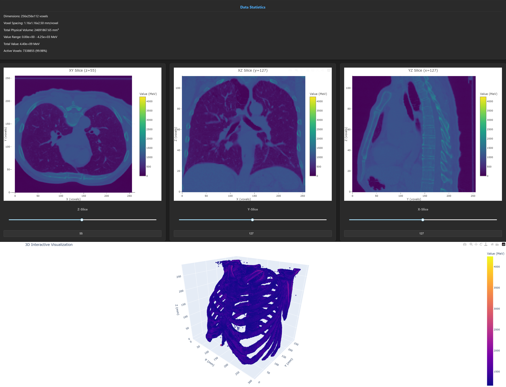

# 3D MHD/RAW Data Viewer

A lightweight, browser-based viewer for 3D data in the `.mhd` and `.raw` formats, commonly used for Geant4 simulation output and medical imaging.



## About The Project

This tool is designed for researchers, students, and engineers working with Geant4 or other software that outputs data in the MHD/RAW format. It provides an easy-to-use interface for visualizing both 3D energy deposition and anatomical data (like CT scans) directly in a web browser, without requiring heavy software installations.

### Features

-   **Interactive 3D Point Cloud:** Visualize your data in a 3D scatter plot with adjustable opacity.
-   **Slice-by-Slice Viewer:** Inspect your data along the X, Y, and Z axes with synchronized sliders.
-   **Data Statistics:** Get an instant overview of your dataset, including dimensions, voxel spacing, energy range, and active voxel counts.
-   **Performance Controls:**
    -   **Thresholding:** Focus on the most significant data points by filtering voxels based on a percentile.
    -   **Downsampling:** Drastically improve performance with large datasets by loading a subset of the voxels.
-   **Anatomical Orientation Correction:** Automatically detects and corrects for standard medical imaging orientations (e.g., "Inferior" Z-axis).

## Getting Started

Follow these steps to get the viewer running on your local machine.

### Prerequisites

-   Python 3.6 or higher
-   `git` for cloning the repository

### Installation

1.  **Clone the repository**

    ```bash
    git clone https://github.com/Bartifle/3D-mhd-displayer.git
    cd 3D-mhd-displayer
    ```

2.  **Create and activate a virtual environment (recommended)**

    ```bash
    # Create the environment
    python -m venv venv

    # Activate on Windows
    .\venv\Scripts\activate

    # Activate on macOS/Linux
    source venv/bin/activate
    ```

3.  **Install dependencies**
    ```bash
    pip install -r requirements.txt
    ```

## Usage

The application can be launched by pointing it to a `.mhd` file. The corresponding `.raw` file is automatically detected if it has the same base name.

```bash
# Basic usage (launches both 3D and Slice viewers)
python geant4_3D_viewer.py ./testfiles/your_data.mhd
```

### Command-Line Arguments

For more control, you can use the following command-line arguments:

| Argument       | Shorthand | Description                                               | Default         | Example          |
| :------------- | :-------- | :-------------------------------------------------------- | :-------------- | :--------------- |
| `mhd_file`     |           | **Required.** Path to the `.mhd` metadata file.           |                 | `test.mhd`       |
| `raw_file`     |           | Path to the `.raw` data file.                             | (auto-detected) | `test.raw`       |
| `--mode`       |           | The visualization mode to launch.                         | `all`           | `--mode 3d`      |
| `--unit`       |           | Specify the data unit (`MeV` or `HU`).                    | `MeV`           | `--unit HU`      |
| `--threshold`  |           | The percentile of active voxels to display.               | `40`            | `--threshold 90` |
| `--downsample` |           | Factor to downsample data by (e.g., 2 = 8x fewer voxels). | `1`             | `--downsample 2` |
| `--show-all`   |           | Show all voxels, ignoring the threshold.                  | `False`         | `--show-all`     |
| `--help`       | `-h`      | Show the help message and exit.                           |                 | `--help`         |

### Examples

**Viewing a specific mode:**

```bash
# Launch only the 3D viewer
python geant4_3D_viewer.py data.mhd --mode 3d

# Launch only the slice viewer
python geant4_3D_viewer.py data.mhd --mode slices
```

**Optimizing performance for a large file:**

```bash
# View a dense CT scan by downsampling and showing only the top 50% of voxels
python geant4_3D_viewer.py chest_ct.mhd --downsample 2 --threshold 50
```

## License

This project is distributed under the MIT License. See the `LICENSE` file for more information.
